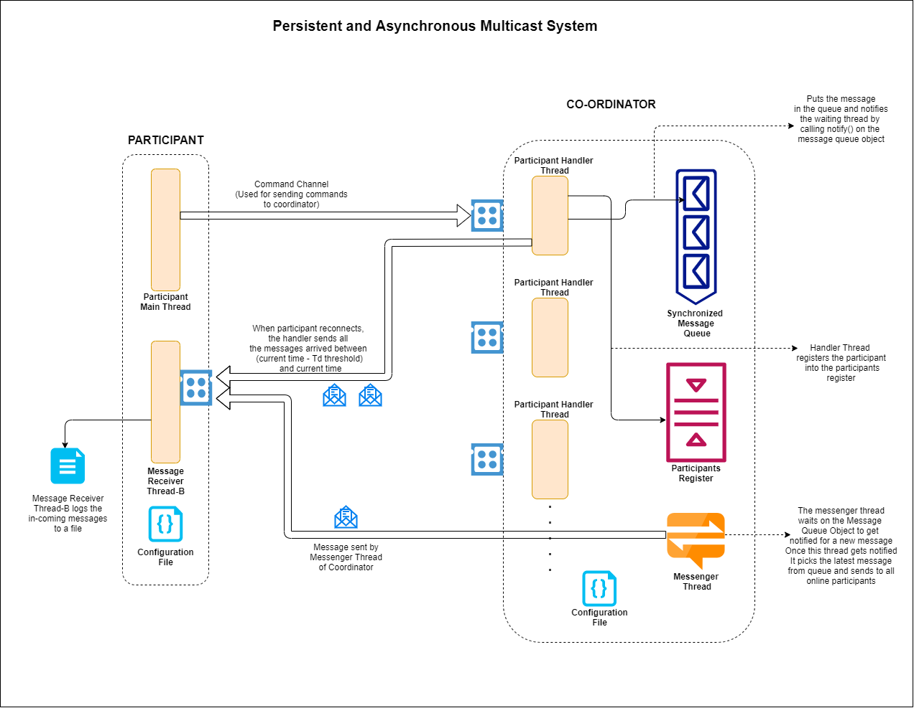

# Persistent and Asynchronous Multicast System

> Distributed Computing Systems (Spring 2021 CSCI 6780) - Project 3

> Team Members: Shubham Shingate, Vipul Shinde

> Technologies Used: Java 1.8

> Problem Statement: To implement a Persistent and Asynchronous Multicast System

In this project, we have implemented a system for supporting persistent asynchronous multicast on top of TCP. It is based on a coordinator-participant paradigm. We have implemented both the multicast coordinator and the participants. 

## Persistent and Asynchronous Multicast Model 
In a multicast communication paradigm, the messages sent to a multicast group are received by all members of the group (including the sender) at the time the message was sent. Asynchronous implies that a sender is not blocked until everyone in the multicast group receives the message -- it is unblocked as soon as it receives an acknowledgement from the coordinator. Persistence guarantee implies that an offline participant, upon reconnection, will receive messages that were sent when it was offline. If a participant is online when a message was multicast, it should get the message immediately (i.e., messages should not be bundled for online participants). 
We have implemented a slightly modified version of persistence called “temporally-bound persistence”. In this model, if a participant is offline more than some specified time threshold (say td), upon reconnecting, it will receive messages that were sent in the past ‘td’ seconds. In other words, the messages sent before ‘td’ will be permanently lost to the participant. If a participant is disconnected less than or equal to td seconds, it should not lose any messages. 
The participants send and receive multicast messages to and from the coordinator (i.e., participants do not directly communicate with each other). The coordinator manages the multicast group, handles all communication and stores messages for persistence.

## Participant Details:
It is assumed that each participant has a unique ID provided in the configuration file (see below). For simplicity, it is assumed that a participant does not migrate from one host to another. However, it may change its ports upon disconnection and reconnection. Each participant has at least two threads (you can have more threads depending on your design). One thread (thread-A) is for receiving user commands. The second thread (thread-B) waits on a specified port for receiving multicast messages from the coordinator (when the participant is online). All the multicast messages received by the thread are logged in the message log file (see below). When the participant is offline, thread-B will relinquish the port. All the messages received by a participant have been logged in a file in the order they were received. 
The participant program will have one command-line parameter, namely, the configuration file name. The configuration file will have the following format. The first line indicates the ID of the participant. The second line indicates the message log file name. The third line indicates the IP address and port number of the coordinator.
The participant will support the following user commands (format of the command is provided in parenthesis). 

- ### Register (register [portnumber]): 
  Participant has to register with the coordinator specifying its ID, IP address and port number where its thread-B will receive multicast messages (thread-B has to be operational before sending the message to the coordinator). Upon successful registration, the participant is a member of the multicast group and will begin receiving messages. 

- ### Deregister (deregister): 
  Participant indicates to the coordinator that it is no longer belongs to the multicast group. Please note that this is different than being disconnected. A participant that deregisters, may register again. But it will not get any messages that were sent since its deregistration (i.e., it will be treated as a new entrant). Thread-B will relinquish the port and may become dormant or die. 

- ### Disconnect (disconnect):
  Participant indicates to the coordinator that it is temporarily going offline. The coordinator will have to send it messages sent during disconnection (subject to temporal constraint). Thread-B will relinquish the port and may become dormant or die. 

- ### Reconnect (reconnect [portnumber]):
  Participant indicates to the coordinator that it is online and it will specify the IP address and port number where its thread-B will receive multicast messages (thread-B has to be operational before sending the message to the coordinator). 

- ### Multicast Send (msend [message]):
  Multicast [message] to all current members. Note that [message] is an alpha-numeric string (e.g., UGACSRocks). The participant sends the message to the coordinator and unblocks after an acknowledgement is received. 

## Coordinator Details 
As mentioned before, the coordinator manages the multicast group, handles all communication, and stores messages for persistence. For simplicity, it is assumed that there is only one multicast group and all registered participants belong to the same group. The coordinator program will have one command-line parameter, namely, the configuration file name. The configuration file will have the following format. The first line indicates the port number where the coordinator will wait for incoming messages from participants. The second line indicates the persistence time threshold (td) in seconds. When the coordinator starts up, the multicast group is assumed to be empty. Participants join the group through register messages. When the coordinator gets a message from a participant, it first parses the message, acknowledges the receipt of the message, closes the connection, and then performs the requested action. For example, if it receives a “register” message, it will add the participant to the member list. If it receives a multicast message, it will send the message to the members that are currently online. If any members are offline, it will store the message for providing persistence. 

